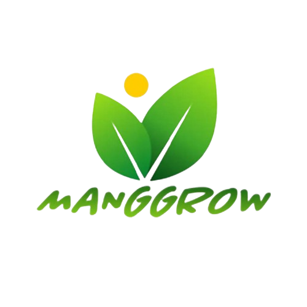
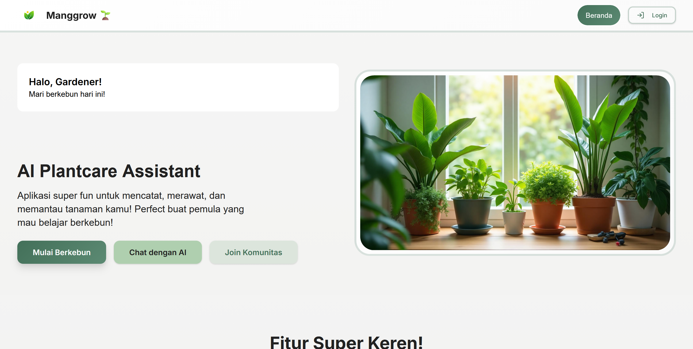
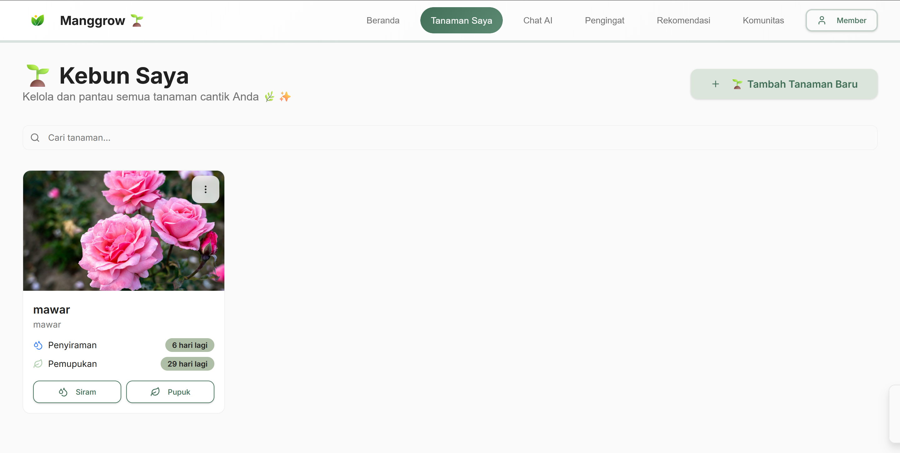
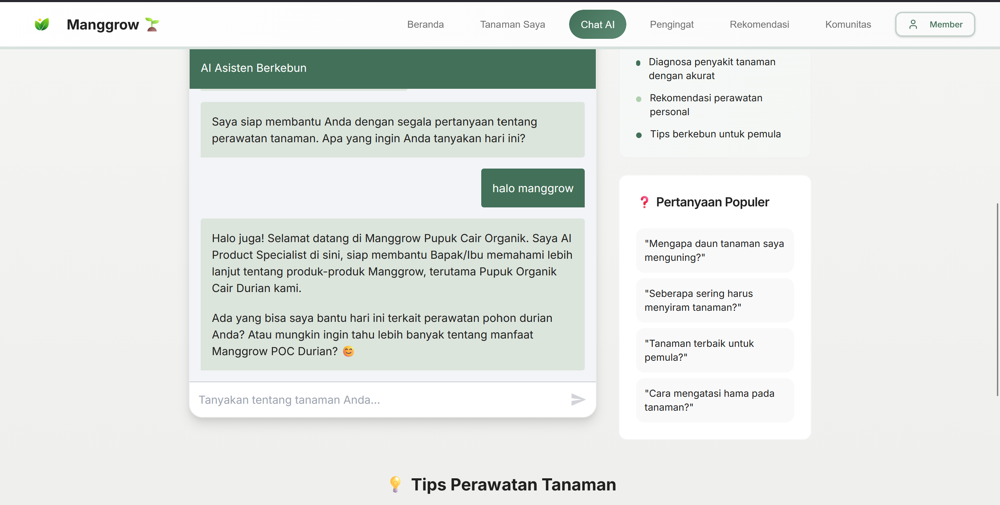
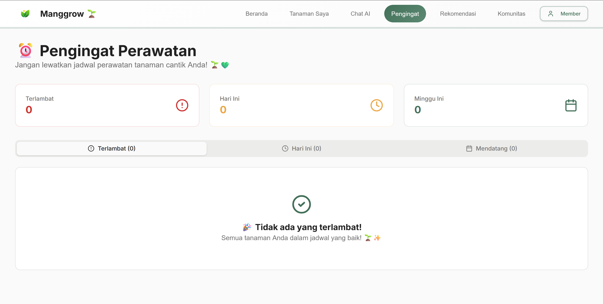
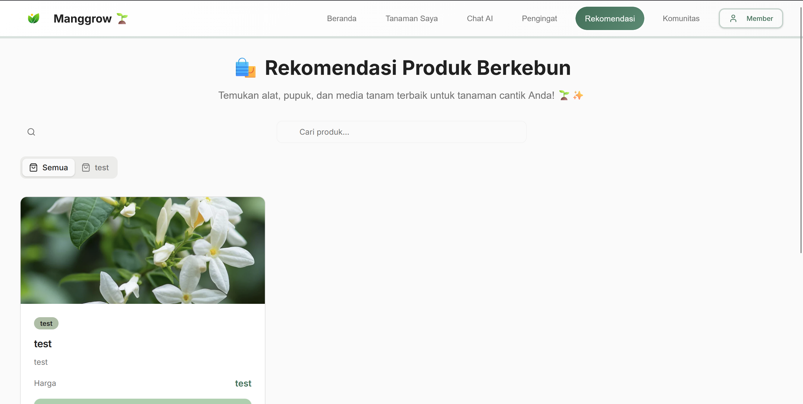
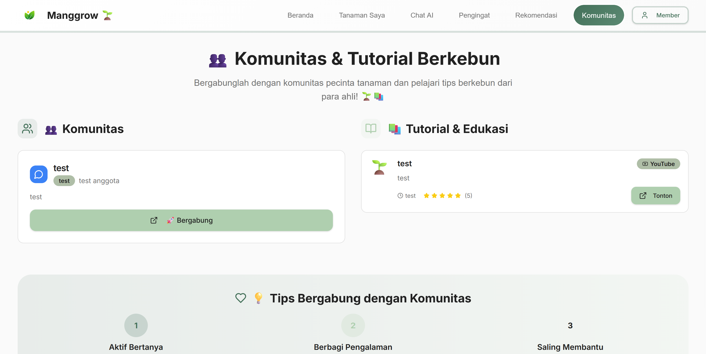
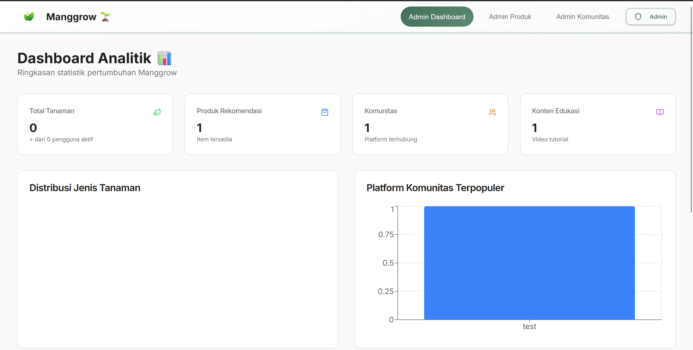
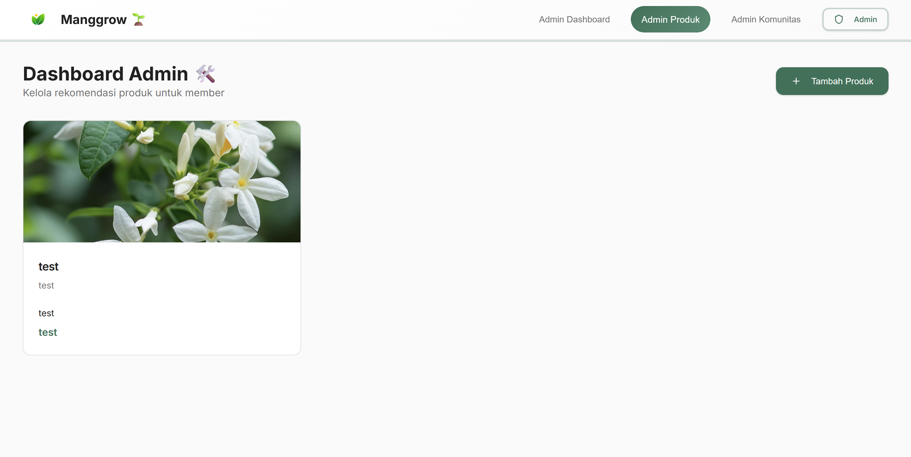
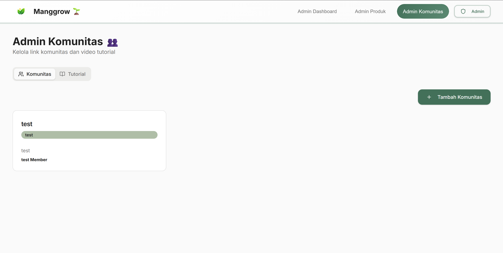

# Manggrow Web Platform 🚀

<div align="center">
  
  <br />
  
</div>

<div align="center">


</div>

---

## 🚀 About The Project

**Manggrow Web Platform** is a comprehensive web application designed to facilitate efficient management and operations for the Manggrow internship project. It features a responsive user interface, real-time data integration, and a seamless user experience.

A standout feature is the **INTELLIGENT AI ASSISTANT**, powered by **n8n** and a **RAG (Retrieval-Augmented Generation)** system. This chatbot allows users to query project documentation and internship guidelines instantly, receiving accurate, context-aware answers.

Designed for **Admins** and **Interns**, it transforms manual tracking processes into a digital, organized, and collaborative workflow.

## 📸 Screenshots

<div align="center">
  
  <br/><br/>
  
  <p float="left">
    
    
     
  </p>
  <p float="left">
    
    
     
  </p>
    <p float="left">
    
    
  </p>
</div>

---

## 💡 Key Features

**Manggrow Web Platform** provides a complete ecosystem for plant lovers and administrators:

### 🌱 For Gardeners (Members)
*   **Smart Garden Helper (Chat AI)**: Consultasi 24/7 dengan AI Assistant yang pintar untuk menanyakan masalah tanaman, tips perawatan, dan rekomendasi pupuk.
*   **My Plants Dashboard**: Catat dan kelola koleksi tanaman Anda. Tambahkan foto, jenis tanaman, dan catatan perkembangan.
*   **Automated Reminders**: Lupa menyiram? Sistem reminder otomatis akan mengingatkan jadwal penyiraman dan pemupukan tanaman spesifik Anda.
*   **Community & Education**: Akses database komunitas pecinta tanaman dan video tutorial terkurasi untuk meningkatkan skill berkebun.
*   **Curated Products**: Dapatkan rekomendasi produk perawatan tanaman terbaik yang sesuai dengan kebutuhan kebun Anda.

### 🛡️ For Administrators
*   **Analytics Dashboard**: Pantau pertumbuhan pengguna, tren tanaman populer, dan performa konten melalui grafik visual (Pie, Bar, Line Charts).
*   **Content Management**: Kelola link komunitas dan video tutorial secara dinamis tanpa menyentuh kode.
*   **Product Management**: Tambah, edit, dan hapus rekomendasi produk untuk pengguna.

---

## 🧠 n8n Workflow Architecture

The core intelligence of Manggrow is powered by two specialized **n8n workflows** working in tandem. You can find the source JSON files in the `/n8n` directory of this repository:

### 1. **Knowledge Base Powerhouse** 📚
*   **File**: `n8n/SeV1IQCIV4H9D8QB-Mandesha_Knowledge.json`
*   **Function**: This workflow acts as the **Data Ingestion Engine**. It processes raw text documents (PDFs, docs, etc.) containing agricultural knowledge.
*   **Process**: It splits documents into manageable chunks, generates vector embeddings, and stores them in the **Supabase Vector Store**. This allows the AI to "read" and "remember" vast amounts of plant care information.

### 2. **AI Agent Brain** 🤖
*   **File**: `n8n/E2GaA62H5H1wXDtb-Mandesha_AI_Agent.json`
*   **Function**: This is the customer-facing **Conversational Agent**.
*   **Capabilities**:
    *   **Contextual RAG**: Retrieves relevant context from the vector store created by the Knowledge workflow.
    *   **Natural Language Processing**: Understands user queries about specific plant symptoms (e.g., "Why are my Monstera leaves turning yellow?").
    *   **Response Generation**:Synthesizes expert advice based on the retrieved knowledge, ensuring accurate and helpful answers.

---

## 🛠️ Tech Stack

### 💻 Frontend (Core)
*   **Framework**: **React** (v18)
*   **Language**: **TypeScript**
*   **Build Tool**: **Vite**

### 🔌 State & Backend
*   **State Management**: **TanStack Query**
*   **Backend (Optional)**: **Supabase** (Auth, Database, Storage)

---

## ⚙️ Installation & Setup

### Prerequisites
*   Node.js 18+
*   npm or bun

### 1️⃣ Clone the Repository
```bash
git clone https://github.com/your-org/manggrow-web.git
cd manggrow-web
```

### 2️⃣ Install Dependencies
```bash
npm install
# or
bun install
```

### 3️⃣ Configure Environment
Copy the example environment file and update the values.
```bash
cp .env.example .env
```

### 4️⃣ Run Development Server
```bash
npm run dev
# 💻 App runs at http://localhost:8080 or port shown in terminal
```

---

## 📂 Project Structure

A clean, clear structure for scalable development.

```text
manggrow-web/
├── .github/                # GitHub templates & workflows
├── public/                 # Static assets
├── src/
│   ├── assets/             # Component-scoped assets
│   ├── components/         # Reusable UI components
│   ├── contexts/           # React Context providers
│   ├── hooks/              # Custom React hooks
│   ├── lib/                # Utilities & helpers
│   ├── pages/              # Route pages
│   ├── App.tsx             # Main App component
│   └── main.tsx            # Entry point
├── .editorconfig           # Editor configuration
├── .env.example            # Environment variables example
└── package.json            # Dependencies & scripts
```

---

<div align="center">

⚡ *Empowering Internship Management with AI-Driven Technology.*

</div>
